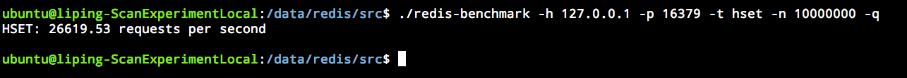
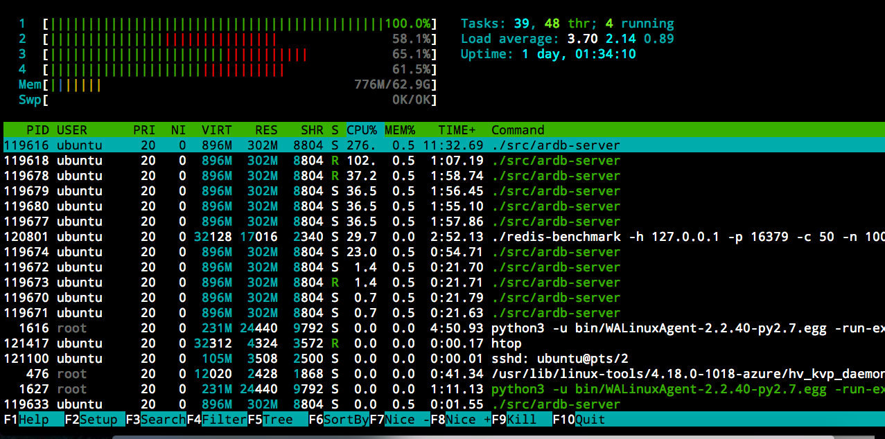
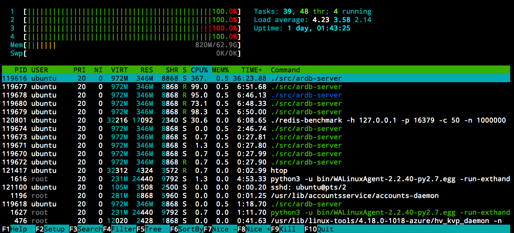
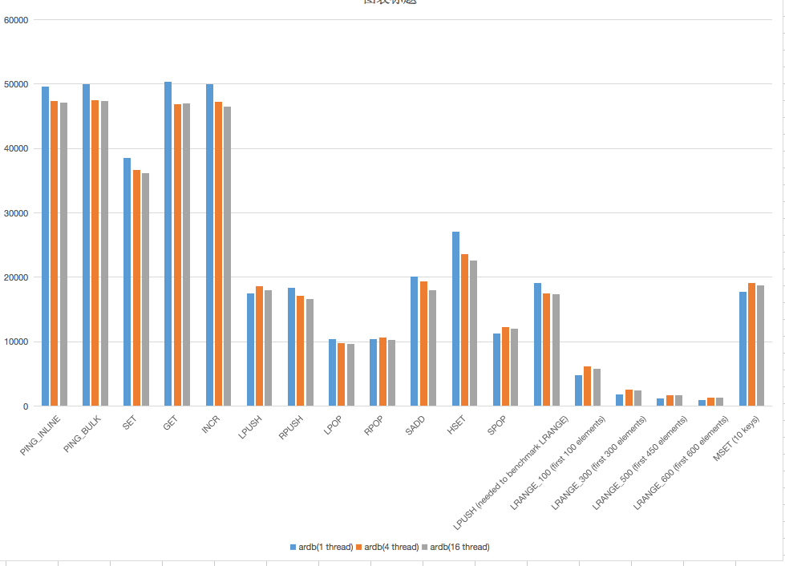
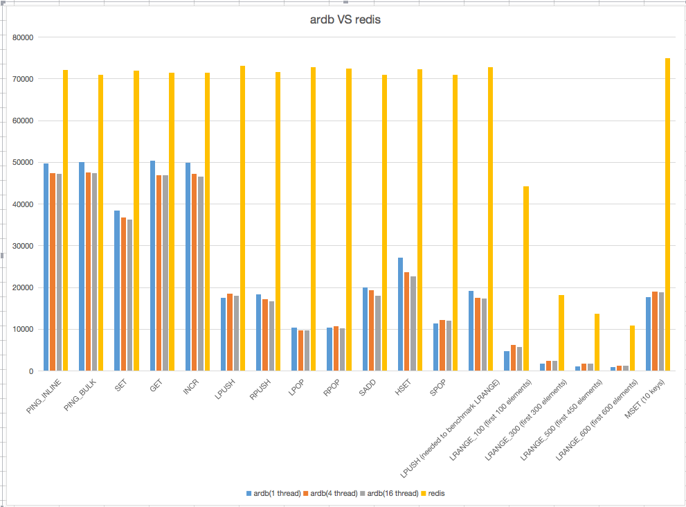
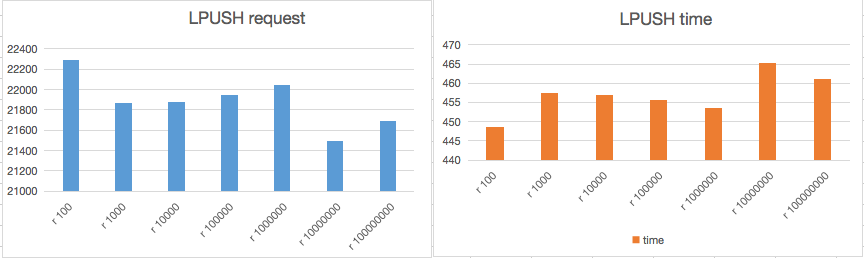
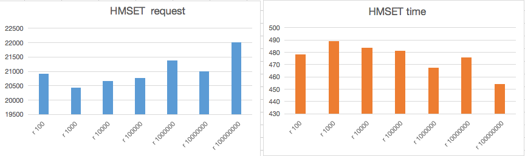
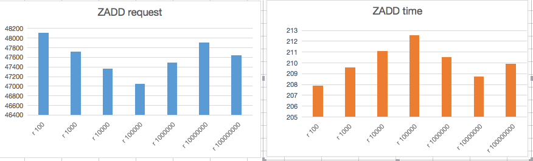

| author                    | time      | version |                                     |
| ------------------------- | --------- | ------- | ----------------------------------- |
| ping.li@conflux-chain.org | 2019.6.5  | v0.0.1  | 先对RocksDB的原理和基础功能进行理解 |
| ping.li@conflux-chain.org | 2019.6.5  | v0.0.2  | 增加对测试环境的配置说明            |
| ping.li@conflux-chain.org | 2019.6.6  | v.0.0.3 | 增加ardb ( redis aof to rocksdb )   |
| ping.li@conflux-chain.org | 2019.6.7  | v.0.0.4 | 增加Benchmark 压测记录              |
| ping.li@conflux-chain.org | 2019.6.7  | v 0.0.5 | 增加Benchmark redis压测记录         |
| ping.li@conflux-chain.org | 2019.6.11 | v 0.06  | 调优&&5亿value 压测 64bytes         |
| ping.li@conflux-chain.org | 2019.6.12 | v 0.07  | 增加分段压测记录                    |

## 一.RocksDB 的原理和概念

[TOC]

## 0.conflux-scan  对DB的需求：

1.测试的DB要满足现在严培的Redis schema文档中，所有的操作的平滑迁移。

2.写出对应的RocksDB  schema的文档

3. 其他需求和严培进行沟通

## 1.基础概念

#### features:

- 专为希望在本地或远程存储系统上存储多达数TB数据的应用程序服务器而设计。
- Optimized for storing small to medium size key-values on fast storage -- flash devices or in-memory
- 它适用于具有多个内核的处理器 

1.RocksDB是一个嵌入式KV存储，==key和value是任意字节流==。

2.Get(key), Put(key),Delete(key),Scan(key)

3.是基于 LSM(Log-Structured-Merge Tree) 的典型实现，LSM 的原理是：当读写数据库时，首先纪录读写操作到 Op log 文件中，然后再操作内存数据库，当达到 checkpoint 时，则写入磁盘，同时删除相应的 Op log 文件，后续重新生成新的内存文件和 Op log 文件。

LevelDB 内部采用了内存缓存机制，也就是在写数据库时，首先会存储在内存中，内存的存储结构采用了 skip list 结构，待达到 checkpoint 时，才进行落盘操作，保证了数据库的高效运转。

## 2.LevelDB 总体架构

如上图所示，整个 LevelDB 由以下几部分组成：

1. Write(k,v)，对外的接口
2. Op log，操作日志记录文件
3. memtable，数据库存储的内存结构
4. Immutable memtable，待落盘的数据库内存数据
5. sstable，落盘后的磁盘存储结构
6. manifest，LevelDB 元信息清单，包括数据库的配置信息和中间使用的文件列表
7. current，当前正在使用的文件清单

## 3.Op log结构分析

LevelDB 使用的 Op log 日志采用了文件记录的方式，且==文件使用了 mmap 方式操作==，以提高效率。

Op log 存储切分为 ==32KB 大小的数据块==，每个 32KB 数据块存储着 Op log，每 个Op log 格式如下：

其中：

1. CRC32 为 crc 校验码，保证数据的完整性
2. Length，为 Op log 的数据长度
3. Log Type，Op log 的类型，之所以会有类型，是由于 32KB 可能存不下一条 Op log，Op log 有可能跨数据块，类型分为：
   - FULL：代表 Data 包含了所有的数据
   - FIRST：代表该 Data 是 Op log 的开始数据
   - MIDDLE：代表该 Data 是 Op log 的中间数据
   - LAST: 代表该 Data 是 Op log 的结束数据
4. Data，为 Op log 的实际数据

## 4.memtable 结构分析

memtable 是 LevelDB 数据库的内存存储结构，采用了 ==skip list 结构存储==，如下图所示：

> skip list 是一种可以代替平衡树的存储结构，它采用概率的方式来保证平衡，而平衡树则是采用严格的旋转树结构来保证平衡，复杂度会高一些。
> 对于 skip list，会有 n 层链表，其中 0 层保存所有的值，越往上层，保存的值越少。每当插入一个值时，会通过概率计算该值需要插入的最高层级 k，然后从 0~k-1 层，分别插入该值。

其中每个表项的存储结构如下：

==key_size | key_value | sequence_num&type | value_size | value==

其中：

sequence_num：表示操作的序列号，每一个数据项都会带有一个序列号，用以表示数据的新旧程度。

type：表示数据的类型，分为：

- kTypeValue：表明数据有效
- kTypeDeletion：表明数据已经失效，在数据进行 delete 操作时会打上该标识

## 5.sstable 结构分析

==sstable 作为落盘的存储结构，每个 sstable 最大 2MB，==从宏观来看，它属于分层的结构，即：

- level 0：最多存储 4 个 sstable
- level 1：存储不超过 10MB 大小的 sstable
- level 2：存储不超过 100MB 大小的 sstable

level 3 及之后：存储大小不超过上一级大小的 10 倍

之所以这样分层，是为了提高查找效率，也是 LevelDB 名称的由来。当每一层超过限制时，会进行 compaction 操作，合并到上一层，递归进行。

从微观的角度看，每个 sstable 文件结构入下图所示：

其中：

- Data Block 存储具体的 k-v 数据
- Meta Block 存储索引过滤信息，用于快速定位 key 是否存在于 Data Block 中
- Meta Index Block 存储 Meta Block 的偏移位置及大小
- Index Block 存储 Data Block 的偏移位置及大小
- Footer 则存储 Meta Index Block 和 Index Block 的偏移位置及大小，相当于二级索引，Footer 的结构如下：
  

另外 Data Block 及 Meta Block 的存储格式是统一的，都是如下格式：

其中 type 表示是否是压缩存储，目前 LevelDB 支持 key 值的 snappy 压缩或者不压缩。

而上图中的 Block data 的格式则为：

上图有几点要说明：

1. 对于 Block data 中的第一项总是不压缩存储的，不压缩存储的项称为 restarts，会被记录在上图的最尾部，同时每隔 k 个值（k 值可定制），都会存储一个不压缩的项，这些都称为 restarts，都会被记录在最尾部。
2. 每个 restarts 表项会作为索引项存储。
3. 除了 restarts 表项以外，其它的表项则基于该 restarts 项，计算跟他相同部分和不同部分，上图中的 shared_bytes 和 unshared_bytes 记录了相同部分长度和不同部分的长度，key_delta 则记录了不同的部分的值，value_length 和 value 则记录了 value 部分的值。
4. 压不压缩是可选的，默认会进行 snappy 压缩。

对于 Meta Block 来说，它保存了用于快速定位 key 是否在 Data Block 中的信息，具体方法是：

1. 采用了 ==bloom filter 的过滤机制==，bloom filter 是一种 hash 机制，它对每一个 key，会计算 k 个 hash 值，然后在 k 个 bit 位记录为 1。当查找时，相应计算出 k 个 hash 值，然后比对 k 个 bit 位是否为 1，只要有一个不为 1，则不存在。
2. 对于每一个 Data Block，所有的 key 值会传入进行 bloom filter 的 hash 计算，每个 key 存储 k 个 bit 位值。

## 5.版本管理

对于 LevelDB 来说，它采用了简单的 ==sequence num 机制==来管理，具体为：

1. 对于 Op log 文件，每一个 Op log 文件名中会包含一个唯一的 sequence num，每创建一个新的 Op log 文件，sequence num 则加 1，sequence num 越大，则表示文件越新，同时最新的 sequence num 会记录下来。
2. 对于每个 key-value 对，也会对应一个 sequence num，对于同一个 key，如果后续更新值时，sequence num 也会相应更新，这样就可以根据 sequence num 的大小，找到最新的 key-value 对

## 6.新增特性

1. 支持模糊查询

   该功能支持 key 以模糊规则匹配的方式进行数据库查询，支持＊和？两种模糊规则查询。

2. 支持 JSON 格式数据存储

   该功能支持 k-v 中，v以json格式传入，后续可以通过关键字，查询json里面的数据。

## 二.RocksDB和LevelDB 和Redis的主要区别

   RocksDB 丰富了很多LevelDB的特性，所以RocksDB有很多LevelDB没有的功能：

###   下面是RocksDB有的但是LevelDB没有的功能

####  1.性能 Performance

- 多线程压缩
- 多线程 memtable  inserts
- 减少DB互斥量(mutex) 持有量(holding)
- 优化level-based compaction style and universal compaction style
- 前缀布隆过滤器
- Memtable 过滤器
- 单布隆过滤器覆盖整个SST文件
- 写锁优化
- 改进了Iter :: Prev（）性能
- 在SkipList搜索期间更少的比较器调用
- 使用大页面分配可记忆内存。

#### 2.特征  Features

- 列族  Column Families
- Transactions和WriteBatchWithIndex
- backup 和Checkpoints
- Merge Operators
- Compaction过滤器
- RocksDB Java (封装的一个API)
- 手动压缩与自动压缩并行运行
- 持久缓存
- 批量加载
- 前向迭代器/尾部迭代器  Forward Iterators/ Tailing iterator
- 单删除
- 删除范围内的文件
- Pin iterator key/value

#### 3.替代数据结构和格式

- 仅用于内存的用例的纯表格式
- 基于矢量和基于散列的可记忆格式
- 基于时钟的缓存（即将推出）
- 可插拔信息日志
- 使用blob注释事务日志写入（用于复制）

#### 4.可调性

- 限速
- 可调缓慢和停止阈值
- 保持所有文件打开的选项
- 选项将所有索引和布隆过滤器块保留在块缓存中
- 多种WAL恢复模式
- Fadvise提示readahead并避免在OS页面缓存中进行缓存
- 用于在内存中固定L0文件的索引和布隆过滤器的选项
- 更多压缩类型：zlib，lz4，zstd
- 压缩词典
- 校验和类型：xxhash
- 每个级别的级别大小乘数和压缩类型不同。

#### 5.可管理性

- 统计
- 线程局部分析
- 命令行工具中的更多命令
- 用户定义的表属性
- 事件听众
- 更多数据库属性
- 动态选项更改
- 从字符串或地图中获取选项
- 选项文件的持久选项

## 三.Install

文档：<https://github.com/facebook/rocksdb/blob/master/INSTALL.md>

### 1.Python Client -测试使用

Test 环境：

 1.web3.py 用来和conflux 进行交互 ，  web3 requires Python '>=3.5.3,<4'

2.rocksDB mac 客户端，brew install rocksDB

3.python rocksdb client  ： pip install git+git://github.com/twmht/python-rocksdb.git#egg=python-rocksdb

Github : <https://github.com/twmht/python-rocksdb>

坑：pip uninstall cython 

​        卸载掉老版本的 cython  安装最新的的cython-0.29.10  不然编译不过去！

## 四. 支持的功能测试

#### 1.Open  数据库连接参数

#### 2.Access

	- put
	- get
	- delete

#### 3.Iteration

#### 4.Snapshots 快照

#### 5.MergeOperator

#### 6.PrefixExtractor

#### 7.Backup And Restore

#### 8.Change Memtable Or SST Implementations

待续…...

## 五.Benchmark

### 1.服务器配置

CPU：Intel(R) Xeon(R) CPU E5-2673 v4 @ 2.30GHz    1 CPU  4核  64G 内存  5T硬盘

OS version：4.18.0-1018-azure #18~18.04.1-Ubuntu

gcc version :  7.4.0 (Ubuntu 7.4.0-1ubuntu1~18.04)

ardb version:Ardb server v=0.10.0 bits=64 engine=rocksdb

redis version：5.0

rocksdb's options:   

  write_buffer_size=512M;
  max_write_buffer_number=16;
  min_write_buffer_number_to_merge=3;
  compression=kSnappyCompression;
  bloom_locality=1;
  memtable_prefix_bloom_size_ratio=0.1;
  block_based_table_factory={block_cache=512M;filter_policy=bloomfilter:10:true};
  create_if_missing=true;
  max_open_files=10000;
  rate_limiter_bytes_per_sec=50M;
  use_direct_io_for_flush_and_compaction=true;
  use_adaptive_mutex=true

### 2.CPU 内存占用：

### 3.压测结果

|                                    | ardb(1 thread) | ardb(4 thread) | ardb(16 thread) | redis    |
| ---------------------------------- | -------------- | -------------- | --------------- | -------- |
| PING_INLINE                        | 49659.83       | 47366.43       | 47167.59        | 72150.07 |
| PING_BULK                          | 49987.5        | 47496.91       | 47359.7         | 71022.73 |
| SET                                | 38523.77       | 36726.9        | 36214.82        | 71994.24 |
| GET                                | 50317          | 46877.93       | 46946.15        | 71505.19 |
| INCR                               | 49965.02       | 47196.53       | 46544.1         | 71413.27 |
| LPUSH                              | 17526.33       | 18569.41       | 17988.85        | 73046.02 |
| RPUSH                              | 18415.53       | 17165.03       | 16629.25        | 71679.45 |
| LPOP                               | 10387.34       | 9804.21        | 9662.12         | 72721.98 |
| RPOP                               | 10447.14       | 10721.22       | 10272.95        | 72532.09 |
| SADD                               | 20082.74       | 19385.11       | 18000.5         | 71037.87 |
| HSET                               | 27106.88       | 23661.36       | 22646.98        | 72301.35 |
| SPOP                               | 11328.75       | 12270.99       | 12089.56        | 70997.52 |
| LPUSH (needed to benchmark LRANGE) | 19174.72       | 17519.88       | 17402.5         | 72732.56 |
| LRANGE_100 (first 100 elements)    | 4775           | 6217.59        | 5789.68         | 44324.27 |
| LRANGE_300 (first 300 elements)    | 1764.68        | 2521.62        | 2498.07         | 18266.18 |
| LRANGE_500 (first 450 elements)    | 1195.13        | 1735.32        | 1695.77         | 13681.39 |
| LRANGE_600 (first 600 elements)    | 903.51         | 1314.46        | 1286.49         | 10954.94 |
| MSET (10 keys)                     | 17732.38       | 19084.33       | 18802.65        | 74996.25 |

-------------------------------------------------------------------------------

write_buffer_size = 2048M 

max_write_buffer_number=2

min_write_buffer_number_to_merge=3

"PING_INLINE","47089.85"

"PING_BULK","46783.62"

"SET","36331.93"

"GET","47312.64"

"INCR","48222.98"

"LPUSH","17512.52"

"RPUSH","17666.28"

"LPOP","11047.53"

"RPOP","10618.98"

"SADD","18976.05"

"HSET","26562.54"

"SPOP","13604.33"

"LPUSH (needed to benchmark LRANGE)","19145.35"

"LRANGE_100 (first 100 elements)","12585.90"

"LRANGE_300 (first 300 elements)","4908.89"

"LRANGE_500 (first 450 elements)","3388.89"

"LRANGE_600 (first 600 elements)","2575.57"

"MSET (10 keys)","20855.06"

-------------------------------------------------------------------------------

-------------------------------------------------------------------------------

write_buffer_size = 20480M 

max_write_buffer_number=2

min_write_buffer_number_to_merge=3

"PING_INLINE","47238.89"

"PING_BULK","47096.50"

"SET","36508.34"

"GET","47569.21"

"INCR","47885.84"

"LPUSH","17933.68"

"RPUSH","17717.93"

"LPOP","10217.95"

"RPOP","10638.52"

"SADD","19117.54"

"HSET","26020.66"

"SPOP","12038.76"

"LPUSH (needed to benchmark LRANGE)","19061.05"

"LRANGE_100 (first 100 elements)","12025.30"

"LRANGE_300 (first 300 elements)","4830.45"

"LRANGE_500 (first 450 elements)","3319.39"

"LRANGE_600 (first 600 elements)","2545.84"

"MSET (10 keys)","20663.72"

------

------

write_buffer_size = 2048M 

max_write_buffer_number=2

min_write_buffer_number_to_merge=6

./redis-benchmark -h 127.0.0.1 -p 16379 -c 50 -r 1000000 -n 1000000 zadd ss 0 ele:rand:000000000000  --csv
====== zadd ss 0 ele:rand:000000000000 --csv ======

  1000000 requests completed in 21.12 seconds
  50 parallel clients

  3 bytes payload

  keep alive: 1

99.55% <= 1 milliseconds 

99.94% <= 2 milliseconds

99.96% <= 3 milliseconds

99.97% <= 4 milliseconds

99.98% <= 5 milliseconds

99.98% <= 6 milliseconds

99.99% <= 7 milliseconds

99.99% <= 8 milliseconds

99.99% <= 9 milliseconds

100.00% <= 9 milliseconds

47355.21 requests per second

./redis-benchmark -h 127.0.0.1 -p 16379 -c 50 -r 1000000 -n 1000000 ==-P 32==  zadd ss 0 ele:rand:000000000000  --csv

====== zadd ss 0 ele:rand:000000000000 --csv ======

1000000 requests completed in 0.97 seconds

  50 parallel clients

  3 bytes payload

  keep alive: 1

45.35% <= 1 milliseconds

89.94% <= 2 milliseconds

95.78% <= 3 milliseconds

97.64% <= 4 milliseconds

98.40% <= 5 milliseconds

98.68% <= 6 milliseconds

99.04% <= 7 milliseconds

99.30% <= 8 milliseconds

99.51% <= 9 milliseconds

99.75% <= 10 milliseconds

99.80% <= 11 milliseconds

99.84% <= 12 milliseconds

99.88% <= 13 milliseconds

99.91% <= 14 milliseconds

99.93% <= 15 milliseconds

99.94% <= 16 milliseconds

99.96% <= 20 milliseconds

99.99% <= 21 milliseconds

100.00% <= 21 milliseconds

1030927.81 requests per second

### 优化点

#### 1.针对IO过高，我们采用管道来应对，来提高效率，节省IO的时间。

#### 2.需要一个长时间的压测

## ISSUE

1. 多线程几乎没意义，写的时候多线程没有提高效率
2. value需要改成64 hash
3. Z操作没有，要想办法搞上去  Ordered Set 
4. HMSET没有，要想办法搞上去，我们每个tx都要用hmset存下每一个field
5.  LLEN ZCARD等询问长度的我觉得应该效率还好，出于保险起见最好也看一下

#### New ISSUE 

  1.压测LPUSH， ZADD   64 byte playload

   ./redis-benchmark -h 127.0.0.1 -p 16379 -t lpush  -r 1000000 -n 1000000 -d 64
====== LPUSH ======
  1000000 requests completed in 52.95 seconds
  50 parallel clients
  64 bytes payload
  keep alive: 1

0.38% <= 1 milliseconds

20.47% <= 2 milliseconds

75.72% <= 3 milliseconds

94.58% <= 4 milliseconds

98.73% <= 5 milliseconds

99.52% <= 6 milliseconds

99.73% <= 7 milliseconds

99.82% <= 8 milliseconds

99.87% <= 9 milliseconds

99.90% <= 10 milliseconds

99.92% <= 11 milliseconds

99.95% <= 12 milliseconds

99.96% <= 13 milliseconds

99.97% <= 14 milliseconds

99.97% <= 15 milliseconds

99.98% <= 16 milliseconds

99.98% <= 17 milliseconds

99.98% <= 18 milliseconds

99.98% <= 19 milliseconds

99.98% <= 20 milliseconds

99.99% <= 21 milliseconds

99.99% <= 22 milliseconds

99.99% <= 23 milliseconds

100.00% <= 24 milliseconds

100.00% <= 25 milliseconds

100.00% <= 27 milliseconds

100.00% <= 28 milliseconds

100.00% <= 29 milliseconds

100.00% <= 31 milliseconds

100.00% <= 31 milliseconds

18885.38 requests per second

#### ISSUE Test

1.conflux full node 启动： ./target/release/conflux --jsonrpc-http-port=12345 --load-test-chain=test/blockchain_tests/general_2.json --test-mode true --jsonrpc-cors all

2.ardb 的启动： src 目录下的 ardb-server

3.conflux_scan_api :  改动db 目录下的createrclient 的端口为ardb的端口 ：16973

4.如果想查看ardb中写入的数据，可以启动reidis-cli  -port 16973 来查看。

5.构造压测branch   ———>ardb branch

6.修改服务器的内核参数来放大多个文件描述符，core 等，ulimit -a 现实各个为 ulimited 

7.压测：

#### LPUSH 

1. ./redis-benchmark -h 127.0.0.1 -p 16379 -t lpush  -r 100 -n 10000000 -d 64

   ====== LPUSH ======
     10000000 requests completed in 448.55 seconds
     50 parallel clients
     64 bytes payload
   22294.21 requests per second

   

2. ./redis-benchmark -h 127.0.0.1 -p 16379 -t lpush  -r 1000 -n 10000000 -d 64

   10000000 requests completed in 457.35 seconds
     50 parallel clients
     64 bytes payload
   21865.19 requests per second

3. ./redis-benchmark -h 127.0.0.1 -p 16379 -t lpush  -r 10000 -n 10000000 -d 64

   10000000 requests completed in 456.99 seconds
     50 parallel clients
     64 bytes payload
   21882.32 requests per second

4. ./redis-benchmark -h 127.0.0.1 -p 16379 -t lpush  -r 100000 -n 10000000 -d 64

   10000000 requests completed in 455.67 seconds
     50 parallel clients
     64 bytes payload
   21945.80 requests per second

5. ./redis-benchmark -h 127.0.0.1 -p 16379 -t lpush  -r 1000000 -n 10000000 -d 64

   10000000 requests completed in 453.64 seconds
     50 parallel clients
     64 bytes payload
     keep alive: 1

   22044.11 requests per second

6. ./redis-benchmark -h 127.0.0.1 -p 16379 -t lpush  -r 10000000 -n 10000000 -d 64

   10000000 requests completed in 465.22 seconds
     50 parallel clients
     64 bytes payload
     keep alive: 1

   21495.12 requests per second

7. ./redis-benchmark -h 127.0.0.1 -p 16379 -t lpush  -r 100000000 -n 10000000 -d 64

10000000 requests completed in 461.07 seconds
  50 parallel clients
  64 bytes payload
  keep alive: 1

21688.73 requests per second

#### HMSET

1. ./redis-benchmark -h 127.0.0.1 -p 16379  -r 100 -n 10000000 -P 32 -d 64 hmset  myhash rand_int rand_int rand_int rand_int
   ====== hmset myhash rand_int rand_int rand_int rand_int ======
     10000000 requests completed in 478.27 seconds
     50 parallel clients
     64 bytes payload
     keep alive: 1

   20908.78 requests per second

2. ./redis-benchmark -h 127.0.0.1 -p 16379  -r 1000 -n 10000000 -P 32 -d 64 hmset  myhash rand_int rand_int rand_int rand_int
   ====== hmset myhash rand_int rand_int rand_int rand_int ======
     10000000 requests completed in 489.17 seconds
     50 parallel clients
     64 bytes payload
     keep alive: 1

   20442.58 requests per second

3. ./redis-benchmark -h 127.0.0.1 -p 16379  -r 10000 -n 10000000 -P 32 -d 64 hmset  myhash rand_int rand_int rand_int rand_int
   ====== hmset myhash rand_int rand_int rand_int rand_int ======
     10000000 requests completed in 483.89 seconds
     50 parallel clients
     64 bytes payload
     keep alive: 1

   20665.77 requests per second

4. ./redis-benchmark -h 127.0.0.1 -p 16379  -r 100000 -n 10000000 -P 32 -d 64 hmset  myhash rand_int rand_int rand_int rand_int
   ====== hmset myhash rand_int rand_int rand_int rand_int ======
     10000000 requests completed in 481.34 seconds
     50 parallel clients
     64 bytes payload
     keep alive: 1

   20775.16 requests per second

   

5. ./redis-benchmark -h 127.0.0.1 -p 16379 -t hmset  -r 1000000 -n 10000000 -d 64

   ./redis-benchmark -h 127.0.0.1 -p 16379  -r 1000000 -n 10000000 -P 32 -d 64 hmset  myhash rand_int rand_int rand_int rand_int
   ====== hmset myhash rand_int rand_int rand_int rand_int ======
     10000000 requests completed in 467.57 seconds
     50 parallel clients
     64 bytes payload
     keep alive: 1

   21387.40 requests per second

6. ./redis-benchmark -h 127.0.0.1 -p 16379  -r 10000000 -n 10000000 -P 32 -d 64 hmset  myhash rand_int rand_int rand_int rand_int
   ====== hmset myhash rand_int rand_int rand_int rand_int ======
     10000000 requests completed in 476.03 seconds
     50 parallel clients
     64 bytes payload
     keep alive: 1

   21007.12 requests per second

7. ./redis-benchmark -h 127.0.0.1 -p 16379 -t hmset  -r 100000000 -n 10000000 -d 64

   ./redis-benchmark -h 127.0.0.1 -p 16379  -r 100000000 -n 10000000 -P 32 -d 64 hmset  myhash rand_int rand_int rand_int rand_int
   ====== hmset myhash rand_int rand_int rand_int rand_int ======
     10000000 requests completed in 454.09 seconds
     50 parallel clients
     64 bytes payload
     keep alive: 1

   22022.07 requests per second

   #### ZADD

   

   1. ./redis-benchmark -h 127.0.0.1 -p 16379   -r 100 -n 10000000 -d 64 zadd myzset rand_int member:rand_int 
      ====== zadd myzset rand_int member:rand_int ======
        10000000 requests completed in 207.88 seconds
        50 parallel clients
        64 bytes payload
        keep alive: 1

   48105.14 requests per second

   2. ./redis-benchmark -h 127.0.0.1 -p 16379   -r 1000 -n 10000000 -d 64 zadd myzset rand_int member:rand_int
      ====== zadd myzset rand_int member:rand_int ======
        10000000 requests completed in 209.57 seconds
        50 parallel clients
        64 bytes payload
        keep alive: 1

   47716.53 requests per second

   3. ./redis-benchmark -h 127.0.0.1 -p 16379   -r 10000 -n 10000000 -d 64 zadd myzset rand_int member:rand_int
      ====== zadd myzset rand_int member:rand_int ======
        10000000 requests completed in 211.10 seconds
        50 parallel clients
        64 bytes payload
        keep alive: 1

   47371.81 requests per second

   4. ./redis-benchmark -h 127.0.0.1 -p 16379   -r 100000 -n 10000000 -d 64 zadd myzset rand_int member:rand_int
      ====== zadd myzset rand_int member:rand_int ======
        10000000 requests completed in 212.55 seconds
        50 parallel clients
        64 bytes payload
        keep alive: 1

   47048.20 requests per second

   5. ./redis-benchmark -h 127.0.0.1 -p 16379   -r 1000000 -n 10000000 -d 64 zadd myzset rand_int member:rand_int
      ====== zadd myzset rand_int member:rand_int ======
        10000000 requests completed in 210.55 seconds
        50 parallel clients
        64 bytes payload
        keep alive: 1

   47493.75 requests per second

   6. ./redis-benchmark -h 127.0.0.1 -p 16379   -r 10000000 -n 10000000 -d 64 zadd myzset rand_int member:rand_int
      ====== zadd myzset rand_int member:rand_int ======
        10000000 requests completed in 208.72 seconds
        50 parallel clients
        64 bytes payload
        keep alive: 1

   47912.00 requests per second

   7. ./redis-benchmark -h 127.0.0.1 -p 16379   -r 100000000 -n 10000000 -d 64 zadd myzset rand_int member:rand_int
      ====== zadd myzset rand_int member:rand_int ======
        10000000 requests completed in 209.92 seconds
        50 parallel clients
        64 bytes payload
        keep alive: 1

   47637.65 requests per second

## Reference

[1]LevelDB 实现分析： <http://taobaofed.org/blog/2017/07/05/leveldb-analysis/>

[2]python-rocksdb的官方文档： <https://python-rocksdb.readthedocs.io/en/latest/index.html>

[3]RocksDB github wiki：<https://github.com/facebook/rocksdb/wiki>

[4]RocksDB Basics :<https://github.com/facebook/rocksdb/wiki/RocksDB-Basics>

[5]RocksDB Basics Operators : <https://github.com/facebook/rocksdb/wiki/Basic-Operations>

