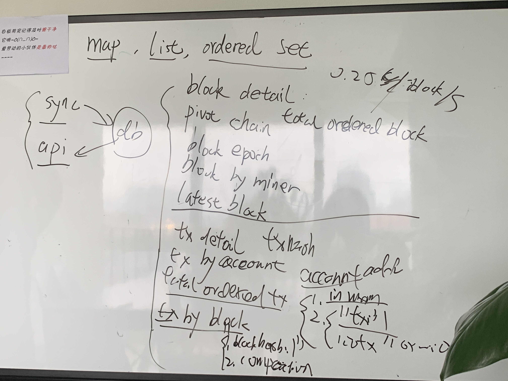

# 一.scan需求： 

1.statistics
    
获得当前的tps/difficulty/blockTime/hashRate

2.Block Detail 获取区块的详细信息
      
根据区块hash 来获取区块的详细信息

3.Block Detail Transaction List
       
根据区块的hash 来获取当前区块包含的交易列表

4.Block Detail Transaction List
    
翻页获取 详细的区块Txs列表

5.Tx List  根据翻页来获取一定数量的Tx 
    
6.Tx Detail 根据交易hash来获取详细的Tx信息
    
7.根据用户的地址来获取 账户的详细信息
    
8.根据用户的地址来获取用户的的所有交易历史记录
    
9.根据矿工的账号地址来获取旷工打包的区块记录
    
~~10.referee block list 关联区块列表~~

# 二.web3向conflux要获取到的数据

1.web3Sync.cfx.getBlock(blockHash, true))

2.web3Sync.cfx.getBlockByHashWithPivotAssumption

----3.web3Sync.cfx.getBlock(pivotBlockHash, false)

----4.web3Sync.cfx.getBlocksByEpoch(epoch.epochNumber))

5.web3Sync.cfx.getBlock(length - 1).then(block => block.hash)

6.web3Sync.cfx.getEpochNumber()

## 三. Sharding Key 

 

1.block detail

2.total ordered block

3.pivot chain

4.block epoch

5.block by miner

==6.latest block==

---------------------------------------------------------

上述1-6的功能因为是0.25s/block  所以可以不用作sharding

下述7-10的功能因为每秒3000TPS的写入量要做sharding

------------------------------------------

7.tx detail  —> sharding key   Tx hash

8.tx  by  account —> sharding key  account_address

9.total ordered Tx ———>   

+ 直接放到内存里  

+ 累加一定数量的tx  ，然后压缩一次写入数据库

10. tx by block  ——>

+ "blockhash:1"  作为sharding key， 1.2.3 ~ len(tx) 
+ 累加一定数量的tx  ，然后压缩一次写入数据库